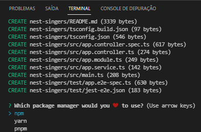
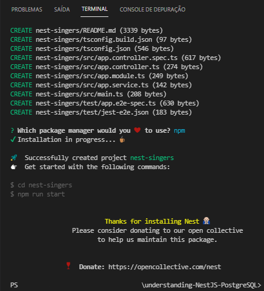
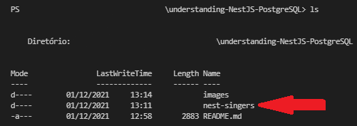
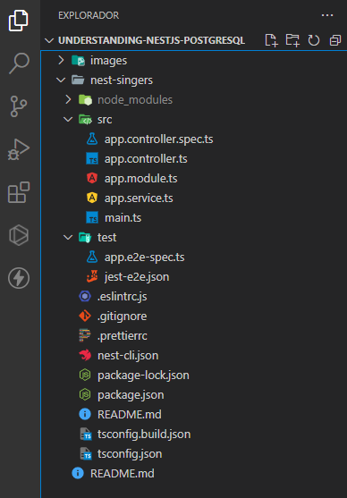

# API REST com NestJS, Prisma e PostgreSQL

**NestJS** é um framework que nos ajuda a escalar de forma eficiente as aplicações construídas em cima do **Node.js**. Possui suporte para **JavaScript** e também **TypeScript**. 

Para entendermos como o Nest estrutura e constrói as coisas uma revisão no assunto de **orientação a objetos** será bastante importante.

O Nest possui diversas semelhanças com o **Express** justamente por ter sido construído em cima dele. Em essência,  continuaremos a construir uma API.

## Escopo

Esta API servirá dados sobre cantoras e seus discos.

`GET` /cantoras 

- Esta rota lista todas as cantoras disponíveis em nosso banco de dados.

`GET` /cantoras/:cantoraId

-  Esta rota exibe as informações a respeito da cantora baseada em seu ID no banco de dados.

`POST` /cantoras

- Esta rota criará uma nova cantora e suas informações em nosso banco de dados.

`PUT` /cantoras/:cantoraId

- Esta rota alterará os dados de determinada cantora baseada em seu ID no banco de dados.

`DELETE` /cantoras/:cantoraId

- Esta rota removerá a cantora e suas informações em nossa base de dados pelo seu ID.

----

`GET` /albuns

- Esta rota lista todas os discos disponíveis em nosso banco de dados.

`GET` /albuns/:albumId

- Esta rota exibe as informações a respeito do disco baseado em seu ID no banco de dados.

`GET` /albuns/:albumId/cantoras

- Esta rota lista todos os discos relacionados a uma cantora pelo seu ID no banco de dados.

`PUT` /albuns/:albumId:cantoras/:cantoraId

- Esta rota atualiza as informações de um determinado disco relacionado à cantora pelo ID no banco de dados.

## Preparando o Ambiente

- VS Code
- Node.js: versão 16.13.0
- NestJs: versão 8.1.5
- Prisma: versão

## Organizando e Entendendo o Ambiente

Para começarmos é necessário criar uma pasta para o projeto. Lembre-se que o nome da pasta não deve:

- Conter espaços, e;
- Caracteres especiais.

O nome da pasta deve com toda a certeza **indicar sobre o que o projeto se trata**. Lembre-se que ao programar não está somente consolidando um conhecimento para você, mas também ajudando outras pessoas no processo.

Após criada a pasta, **abra-a** dentro do VS Code.

Agora, vamos instalar um componente do Nest chamado **CLI**. No terminal em seu VS Code execute o seguinte comando.

```` 
npm i -g @nestjs/cli
````

Para nossos colegas usando Linux ou Mac, o comando de instalação deve acompanhar o **sudo**:

```
sudo npm i -g @nestjs/cli
```

Este comando utilizará o gerenciador de pacotes **npm** para instalar **globalmente** a Nest **CLI** na pasta do projeto.

Após a instalação, cheque se a instalação foi feita com sucesso através do comando:

```
nest -v
```

Se instalado corretamente, deverá aparecer em sua tela a **versão** do Nest instalada.

Indicando agora ao nest que queremos criar um novo projeto com sua estrutura, o seguinte comando no terminal nos ajudará:

``` 
nest new nome-do-projeto
```

Através da CLI o comando **nest** cria um novo projeto. No exemplo de hoje o nome do projeto será **nest-singers**.

```
nest new nest-singers
```

Ao executar estes comandos o terminal fará algumas interações com você, como esta aqui:



Escolheremos o **npm** como nosso gerenciador de pacotes.

> **_NOTA_**: Você pode escolher pelo yarn, porém, certifique-se de que possui este gerenciador de pacotes instalado em seu PC. 

Ao finalizar a instalação, a tela abaixo deve aparecer:



Execute o comando `ls`em seu terminal e cheque se a pasta do projeto criada está lá:



Acesse a pasta do projeto-nest com o comando:

`cd nome-do-projeto`. 

No nosso exemplo: 

`cd nest-singers`

No menu do VS Code podemos ver que diversos arquivos e uma estrutura de pastas foi criada, alguns conhecemos e outros precisaremos conhecer:



- package.json
  - lista todas as dependências que o projeto usa juntamente com as suas versões,e;
  - facilita o compartilhamento com outras pessoas desenvolvedoras
- .gitignore
  - Possui uma lista de arquivos e diretórios que são ignorados no momento de subir a estrutura para o GitHub.
- *.ts
  - 'asterisco' em T.I. representa **tudo**. Aqui estamos falando de todos os arquivos em TypeScript.
- .eslintrc.js
  - Arquivo de configuração do ESLINT, uma ferramenta que identifica e reporta padrões no código, nos retornando erros ou não, e;
  - Evita bugs e torna o código mais consistente.

Na pasta **src**, faça a remoção destes três arquivos:

- app.controller.spec.ts
- app.controller.ts
- app.service.ts

Na pasta **src**, crie a pasta **app** e coloque o arquivo **app.modulde.ts** dentro dela. A árvore de arquivos dentro da pasta do projeto deve estar como abaixo:


Observe que temos alguns pontos em **vermelho**, indicando que algo de errado não está certo! Se abrirmos o arquivo `app.modules.ts` e na barra de opções clicarmos em **problemas**, veremos sobre o quê essas reclamações se tratam.


Estes erros se tratam justamente dos arquivos que excluímos e para resolver este problema, removemos as linhas `2, 3, 7 e 8` do código, deixando-o assim:

```
import { Module } from '@nestjs/common';

@Module({
  imports: [],
})
export class AppModule {}

```

Por hora, não vamos nos preocupar com a funcionalidade do código e sim, ter em mente que este arquivo, **app.modules.ts** é o principal arquivo contendo toda a lógica de funcionamento da nossa API.

No arquivo **main.ts** precisamos dizer que movemos o arquivo **app.module.ts** de lugar:

```
import { NestFactory } from '@nestjs/core';
// Aqui dizemos que o arquivo foi movido
import { AppModule } from './app/app.module';

async function bootstrap() {
  const app = await NestFactory.create(AppModule);
  await app.listen(3000);
}
bootstrap();

```

- `async function bootstrap()` - nesta função está acontecendo a inicialização da nossa API
- `const app = await NestFactory.create(AppModule)` - estamos criando uma aplicação Nest através do **NestFactory** e passando para ela onde está a lógica de funcionamento através de **(AppModule)**
- `await app.listen(3000)` - função que diz que estamos rodando nossa aplicação na porta 300
- `bootstrap()` - precisamos chamar nossa função bootstrap() para dar início a todo processo

Altere também o caminho no arquivo **app.e2e-spec.ts** na pasta **test** para o ESLINT não seguir reclamando:

```
import { AppModule } from './../src/app/app.module';
```

### ESLINT Reclamando de Parsing Error :boom:

Caso as bolinhas vermelhas no VS Code persistam e ao checar a aba problemas você encontrar a seguinte mensagem abaixo escrita:

```
Parsing error: File '.......tsconfig.json' not found.eslint
```

Vá até o arquivo **.eslintrc.js** e faça uma alteração no nome do projeto. Mude de:

```
project: 'tsconfig.json',
```

para:

```
project: 'nome-do-projeto/tsconfig.json',
```

No nosso exemplo:

```
project: 'nest-singers/tsconfig.json',
```

## Criando as Rotas

Em Nest as rotas são criadas através dos **_Controllers_**. Mas o que são eles? O que comem?

- Os _controllers_ são responsáveis por **receber** as requisições **HTTP** e **devolver** uma resposta para o cliente.
- Um único _controller_ podem lidar com `n` rotas configuradas dentro dele.
- Uma aplicação pode ter múltiplos _controllers_ e é recomendável que o tenha para organizar o grupo de rotas que uma determinada funcionalidade desta aplicação em questão terá.

A lógica de funcionamento e caminhos da aplicação não fica dentro destes arquivos, mas eles são os responsáveis por chamá-la em outro.

Vamos criar nosso _controller_ para 'cantoras'.

Na pasta **src** vamos criar a pasta '**cantoras**' e tudo que está relacionado à cantoras ficará dentro deste diretório.

Dentro de `src -> cantoras` vamos criar o arquivo `cantora.controller.ts`

Em Nest, para especificar que vamos criar um _controller_ precisamos de um _**Decorator**_ (O que é isso? O que come?).

Um _decorator_ identifica o que é a coisa que estamos criando e nos ajuda a fazer isso através de seus acessórios.

> Grande parte dos _decorators_ em Nest ficam dentro de @nestjs/commom

Vamos importar o **Decorator** chamado **Controller** para o nosso arquivo:

```
import { Controller } from '@nestjs/common'; //Importanto o Decorator Controller
```

O que estamos dizendo aqui é que estamos importando uma classe chamada '**Controller**' que contém uma série de métodos dentro dela e estes métodos serão chamados ao configurarmos as rotas.

Agora vamos criar uma classe chamada '**CantorasController**' e decorá-la com o Decorator:

```
import { Controller } from '@nestjs/common';

@Controller() //Decorator para a Classe
//Criando a classe CantorasController
class CantorasController {
  
}

```

:bangbang: O que estamos fazendo aqui é criando a classe **Cantoras** e dizendo ao Nest que '**CantorasController**' é uma classe-controller quando adicionamoso o _decorator_ '**@Controller()**' em cima dela. :bangbang:

> Todas as rotas devem ser definidas **dentro** da classe-controller

Olha só que interessante... se observarmos com atenção notaremos um padrão em nossas rotas:

`GET` /cantoras 

`GET` /cantoras/:cantoraId

`POST` /cantoras

`PUT` /cantoras/:cantoraId

`DELETE` /cantoras/:cantoraId

**Elas possuem /cantoras** e nós podemos dizer ao _decorator_ que todas **começam** com `/cantoras` dentro da função `Controller()`.

```
import { Controller } from '@nestjs/common';

@Controller('cantoras') //Dizendo ao Decorator que todas as rotas começam com /cantoras
class CantorasController {
  
}

```

Assim, cada verbo HTTP (GET, PUT, POST e DELETE) dentro do _controller_ vai começar com `/cantoras`.

### `GET` /cantoras 

Vamos dizer ao Nest que estamos criando esta rota e que ela receberá um verbo **GET** via HTTP e vai **retornar** alguma coisa na tela.

```
import { Controller } from '@nestjs/common';

@Controller('cantoras')
class CantorasController {
  //Recebendo verbo GET
  getCantoras() {
  	// Retornando mensagem na tela
    return 'Todas as cantoras';
  }
}

```

`getCantoras()` é um método que estamos chamando quando a requisição chega. Pera, mas como o método sabe que a **requisição entrando** é um GET? Nós o **importamos como um _decorator_**:

```
import { Controller, Get } from '@nestjs/common';
```

E dizemos ao Nest que **getCantoras()** é um método **GET** adicionando-o acima, como fizemos com a Classe:

```
import { Controller, Get } from '@nestjs/common'; //Importanto o Decorator Controller e o Método GET

@Controller('cantoras') //Dizendo ao Decorator que todas as rotas começam com /cantoras
//Criando a classe CantorasController
export class CantorasController {
  // Método GET adicionado
  @Get()
  //Recebendo verbo GET
  getCantoras() {
    // Retornando mensagem na tela
    return 'Todas as cantoras';
  }
}

```

Note que **@Get()** também assume a função de _decorator_, ou seja, uma requisição **GET** em **/cantoras** é direcionada para **getCantoras()**. (Certeza que sua cabeça explodiu agora, né?!)

Agora é a hora que a gente testa, certo?!

WAIT, NOT AINDA... a gente não disse pra nossa aplicação que **cantora.controller** existe! Pra quem a gente diz isso? Pro cara que controla toda a lógica: `app.modules.ts`. 

Nós estamos dizendo que a **chave** controllers recebe um **array** de todos os controllers que queremos:

```
import { Module } from '@nestjs/common';

@Module({
  imports: [],
  // Criando Key e Array
  controllers: [],
})
export class AppModule {}

```

Contudo, a gente precisa antes exportar a nossa classe em **cantora.controller.ts** para que a rota funcione:

```
import { Controller, Get } from '@nestjs/common';

@Controller('cantoras')
//Criando e exportando a classe CantorasController
export class CantorasController {
  @Get()
  getCantoras() {
    return 'Todas as cantoras';
  }
}

```

Agora podemos fazer a importação no arquivo **app.modules.ts**:

```
import { Module } from '@nestjs/common';
import { CantorasController } from '../cantoras/cantora.controller'; // Importando arquivo de configuração

@Module({
  imports: [],
  // Criando Key e Array com a Classe CantorasController
  controllers: [CantorasController],
})
export class AppModule {}

```

No terminal, execute o comando abaixo para iniciar a aplicação:

```
npm run start:dev
```

Se checarmos nosso package.json vemos que este comando é executado desta forma:

```nest start --watch
nest start --watch
```

O que em realidade nos diz que se realizarmos alguma alteração nos arquivos a aplicação é imediatamente reiniciada. 

Se tudo deu certo, seu terminal deve estar mostrando a aplicação sendo executada com sucesso e pode ser testada no Thunder ou Postman ou Insomnia.


O barato na saída deste terminal é a quantidade de informações que temos:

- `LOG [NestFactory] Starting Nest application...` - Aqui o Nest está subindo
- `LOG [InstanceLoader] AppModule dependencies initialized` - Iniciadas todas as dependências necessárias à API
- `LOG [RoutesResolver] CantorasController {/cantoras}` - Controller para Cantoras funcionando
- `LOG [RouterExplorer] Mapped {/cantoras, GET}` - Rota `GET /cantoras` mapeada
- `LOG [NestApplication] Nest application successfully started` - Aplicação Iniciada com sucesso

### No Thunder

**Passo 01** - Altere a URL para o endereço que configuramos: `localhost:3000/cantoras`

**Passo 02** - Certifique-se de que o GET é o verbo que está sendo utilizado.

**Passo 03** - Aperte Send

Se tudo está certo, a resposta '**Todas as cantoras**' deverá aparecer!


## `GET` /cantoras/:cantoraID

Neste momento, como não estamos fazendo uso de um Banco de Dados 
